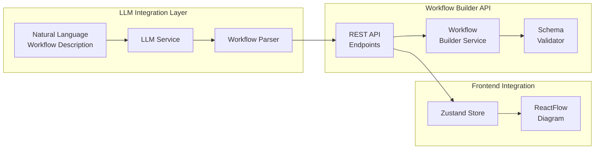
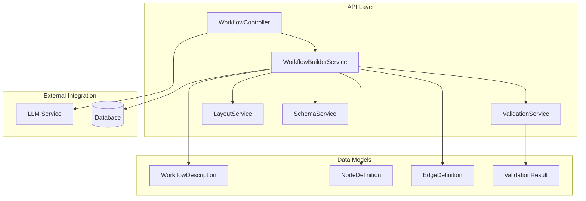

# LLM-Driven Workflow Creation Implementation Plan

## Table of Contents
1. [Overview](#overview)
2. [Architecture](#architecture)
3. [Implementation Plan](#implementation-plan)
4. [Backend API Implementation](#backend-api-implementation)
5. [Testing Strategy](#testing-strategy)
6. [Integration Points](#integration-points)
7. [Next Steps](#next-steps)

## Overview

This document outlines the implementation plan for enabling LLM-driven programmatic creation of workflows in the Workflow Builder application. The goal is to allow users to describe workflows in natural language and have an LLM generate the corresponding workflow structure in the Workflow Builder's design language.

### Key Objectives
- Accept natural language descriptions of workflows
- Convert descriptions into Workflow Builder's data structure
- Programmatically add nodes and edges to create visual workflows
- Maintain compatibility with the existing visual editor

## Architecture

### High-Level Architecture



### Backend Service Architecture



## Implementation Plan

### Phase 1: Core Infrastructure
1. Define data models and DTOs
2. Create validation service
3. Implement schema service
4. Build layout service for node positioning

### Phase 2: API Development
1. Create workflow controller endpoints
2. Implement workflow builder service
3. Add error handling and response types
4. Create comprehensive validation rules

### Phase 3: LLM Integration
1. Design LLM service interface
2. Create prompt templates
3. Implement response parsing
4. Add retry logic and error handling

### Phase 4: Frontend Integration
1. Add API client service
2. Update Zustand store
3. Create UI components for LLM input
4. Implement workflow import functionality

### Phase 5: Testing & Optimization
1. Unit tests for all services
2. Integration tests for API endpoints
3. E2E tests for complete flow
4. Performance optimization

## Backend API Implementation

### Data Models and DTOs

#### WorkflowDescriptionDto
```typescript
// apps/backend/src/diagram/dto/workflow-description.dto.ts
export class WorkflowDescriptionDto {
  name: string;
  description?: string;
  nodes: NodeDescriptionDto[];
  edges: EdgeDescriptionDto[];
  metadata?: {
    createdBy?: 'llm' | 'manual';
    llmModel?: string;
    prompt?: string;
  };
}
```

#### NodeDescriptionDto
```typescript
// apps/backend/src/diagram/dto/node-description.dto.ts
export class NodeDescriptionDto {
  id?: string; // Optional - will be generated if not provided
  type: 'trigger' | 'action' | 'decision' | 'delay' | 'notification' | 'conditional';
  label: string;
  properties: Record<string, any>;
  position?: PositionDto;
  metadata?: {
    description?: string;
    agent?: string; // For multi-agent workflows
  };
}
```

#### EdgeDescriptionDto
```typescript
// apps/backend/src/diagram/dto/edge-description.dto.ts
export class EdgeDescriptionDto {
  id?: string;
  source: string; // Node ID reference
  target: string; // Node ID reference
  label?: string;
  type?: 'default' | 'conditional';
  condition?: {
    expression: string;
    description?: string;
  };
}
```

### API Endpoints

#### WorkflowController
```typescript
// apps/backend/src/diagram/workflow.controller.ts
@Controller('workflow')
export class WorkflowController {
  constructor(
    private readonly workflowBuilderService: WorkflowBuilderService,
    private readonly schemaService: SchemaService,
  ) {}

  @Post('/create')
  async createWorkflow(@Body() workflowDto: WorkflowDescriptionDto) {
    return await this.workflowBuilderService.createWorkflow(workflowDto);
  }

  @Post('/validate')
  async validateWorkflow(@Body() workflowDto: WorkflowDescriptionDto) {
    return await this.workflowBuilderService.validateWorkflow(workflowDto);
  }

  @Post('/generate-from-prompt')
  async generateFromPrompt(@Body() promptDto: { prompt: string; context?: any }) {
    return await this.workflowBuilderService.generateFromPrompt(promptDto);
  }

  @Get('/schemas')
  async getNodeSchemas() {
    return await this.schemaService.getAllNodeSchemas();
  }

  @Get('/schemas/:nodeType')
  async getNodeSchema(@Param('nodeType') nodeType: string) {
    return await this.schemaService.getNodeSchema(nodeType);
  }

  @Post('/layout')
  async calculateLayout(@Body() nodes: NodeDescriptionDto[]) {
    return await this.workflowBuilderService.calculateLayout(nodes);
  }

  @Get('/templates')
  async getWorkflowTemplates() {
    return await this.workflowBuilderService.getTemplates();
  }

  @Post('/import')
  async importWorkflow(@Body() importDto: { format: 'json' | 'yaml'; data: any }) {
    return await this.workflowBuilderService.importWorkflow(importDto);
  }
}
```

### Core Services

#### WorkflowBuilderService
```typescript
// apps/backend/src/diagram/services/workflow-builder.service.ts
@Injectable()
export class WorkflowBuilderService {
  constructor(
    private readonly validationService: ValidationService,
    private readonly layoutService: LayoutService,
    private readonly schemaService: SchemaService,
    private readonly llmService: LlmService,
  ) {}

  async createWorkflow(workflowDto: WorkflowDescriptionDto): Promise<WorkflowResponse> {
    // 1. Validate the workflow
    const validation = await this.validateWorkflow(workflowDto);
    if (!validation.valid) {
      throw new BadRequestException('Invalid workflow', validation);
    }

    // 2. Enrich nodes with IDs and default properties
    const enrichedNodes = await this.enrichNodes(workflowDto.nodes);

    // 3. Calculate positions if not provided
    const positionedNodes = await this.layoutService.positionNodes(
      enrichedNodes,
      workflowDto.edges,
    );

    // 4. Create edges with proper IDs
    const enrichedEdges = this.enrichEdges(workflowDto.edges, positionedNodes);

    // 5. Convert to ReactFlow format
    const reactFlowData = this.convertToReactFlow(positionedNodes, enrichedEdges);

    // 6. Save to database (if implemented)
    // await this.saveWorkflow(reactFlowData);

    return {
      success: true,
      data: reactFlowData,
      metadata: {
        nodeCount: positionedNodes.length,
        edgeCount: enrichedEdges.length,
        createdAt: new Date(),
      },
    };
  }

  async validateWorkflow(workflowDto: WorkflowDescriptionDto): Promise<ValidationResultDto> {
    return await this.validationService.validate(workflowDto);
  }

  async generateFromPrompt(promptDto: { prompt: string; context?: any }) {
    // 1. Call LLM service with structured prompt
    const llmResponse = await this.llmService.generateWorkflow(promptDto.prompt);

    // 2. Parse LLM response
    const workflowDescription = this.parseLlmResponse(llmResponse);

    // 3. Create workflow using standard flow
    return await this.createWorkflow(workflowDescription);
  }

  private async enrichNodes(nodes: NodeDescriptionDto[]): Promise<EnrichedNode[]> {
    return Promise.all(
      nodes.map(async (node, index) => {
        const schema = await this.schemaService.getNodeSchema(node.type);
        const defaultProperties = await this.schemaService.getDefaultProperties(node.type);

        return {
          ...node,
          id: node.id || `${node.type}-${Date.now()}-${index}`,
          properties: {
            ...defaultProperties,
            ...node.properties,
          },
          schema,
        };
      }),
    );
  }

  private enrichEdges(edges: EdgeDescriptionDto[], nodes: EnrichedNode[]): EnrichedEdge[] {
    return edges.map((edge, index) => ({
      ...edge,
      id: edge.id || `edge-${Date.now()}-${index}`,
      source: this.resolveNodeId(edge.source, nodes),
      target: this.resolveNodeId(edge.target, nodes),
    }));
  }

  private convertToReactFlow(nodes: EnrichedNode[], edges: EnrichedEdge[]) {
    return {
      nodes: nodes.map(node => ({
        id: node.id,
        type: 'node', // ReactFlow node type
        position: node.position || { x: 0, y: 0 },
        data: {
          type: node.type,
          properties: node.properties,
          icon: this.getNodeIcon(node.type),
          label: node.label,
        },
      })),
      edges: edges.map(edge => ({
        id: edge.id,
        source: edge.source,
        target: edge.target,
        type: edge.type || 'default',
        data: {
          label: edge.label,
          condition: edge.condition,
        },
      })),
    };
  }
}
```

#### ValidationService
```typescript
// apps/backend/src/diagram/services/validation.service.ts
@Injectable()
export class ValidationService {
  constructor(private readonly schemaService: SchemaService) {}

  async validate(workflow: WorkflowDescriptionDto): Promise<ValidationResultDto> {
    const errors: ValidationErrorDto[] = [];
    const warnings: ValidationWarningDto[] = [];

    // 1. Validate nodes
    for (const node of workflow.nodes) {
      const nodeErrors = await this.validateNode(node);
      errors.push(...nodeErrors);
    }

    // 2. Validate edges
    const nodeIds = new Set(workflow.nodes.map(n => n.id).filter(Boolean));
    for (const edge of workflow.edges) {
      const edgeErrors = this.validateEdge(edge, nodeIds);
      errors.push(...edgeErrors);
    }

    // 3. Validate workflow structure
    const structureErrors = this.validateStructure(workflow);
    errors.push(...structureErrors);

    // 4. Check for warnings (non-critical issues)
    warnings.push(...this.checkWarnings(workflow));

    return {
      valid: errors.length === 0,
      errors,
      warnings,
    };
  }

  private async validateNode(node: NodeDescriptionDto): Promise<ValidationErrorDto[]> {
    const errors: ValidationErrorDto[] = [];

    // Check if node type is valid
    const validTypes = await this.schemaService.getValidNodeTypes();
    if (!validTypes.includes(node.type)) {
      errors.push({
        nodeId: node.id,
        field: 'type',
        message: `Invalid node type: ${node.type}`,
        code: 'INVALID_NODE_TYPE',
      });
    }

    // Validate properties against schema
    const schema = await this.schemaService.getNodeSchema(node.type);
    if (schema) {
      const propertyErrors = await this.validateProperties(node.properties, schema);
      errors.push(...propertyErrors.map(e => ({ ...e, nodeId: node.id })));
    }

    return errors;
  }

  private validateEdge(edge: EdgeDescriptionDto, nodeIds: Set<string>): ValidationErrorDto[] {
    const errors: ValidationErrorDto[] = [];

    if (!nodeIds.has(edge.source)) {
      errors.push({
        edgeId: edge.id,
        field: 'source',
        message: `Source node not found: ${edge.source}`,
        code: 'INVALID_SOURCE_NODE',
      });
    }

    if (!nodeIds.has(edge.target)) {
      errors.push({
        edgeId: edge.id,
        field: 'target',
        message: `Target node not found: ${edge.target}`,
        code: 'INVALID_TARGET_NODE',
      });
    }

    return errors;
  }

  private validateStructure(workflow: WorkflowDescriptionDto): ValidationErrorDto[] {
    const errors: ValidationErrorDto[] = [];

    // Check for trigger nodes
    const triggerNodes = workflow.nodes.filter(n => n.type === 'trigger');
    if (triggerNodes.length === 0) {
      errors.push({
        message: 'Workflow must have at least one trigger node',
        code: 'NO_TRIGGER_NODE',
      });
    }

    // Check for orphaned nodes
    const connectedNodes = new Set<string>();
    workflow.edges.forEach(edge => {
      connectedNodes.add(edge.source);
      connectedNodes.add(edge.target);
    });

    workflow.nodes.forEach(node => {
      if (node.id && !connectedNodes.has(node.id) && node.type !== 'trigger') {
        errors.push({
          nodeId: node.id,
          message: 'Node is not connected to any other node',
          code: 'ORPHANED_NODE',
        });
      }
    });

    return errors;
  }
}
```

#### LayoutService
```typescript
// apps/backend/src/diagram/services/layout.service.ts
@Injectable()
export class LayoutService {
  private readonly NODE_WIDTH = 180;
  private readonly NODE_HEIGHT = 80;
  private readonly HORIZONTAL_SPACING = 250;
  private readonly VERTICAL_SPACING = 150;

  async positionNodes(
    nodes: EnrichedNode[],
    edges: EdgeDescriptionDto[],
  ): Promise<EnrichedNode[]> {
    // If all nodes have positions, return as-is
    if (nodes.every(n => n.position)) {
      return nodes;
    }

    // Use different layout strategies based on workflow complexity
    const layoutStrategy = this.determineLayoutStrategy(nodes, edges);

    switch (layoutStrategy) {
      case 'hierarchical':
        return this.hierarchicalLayout(nodes, edges);
      case 'dagre':
        return this.dagreLayout(nodes, edges);
      case 'force':
        return this.forceDirectedLayout(nodes, edges);
      default:
        return this.simpleGridLayout(nodes);
    }
  }

  private hierarchicalLayout(
    nodes: EnrichedNode[],
    edges: EdgeDescriptionDto[],
  ): EnrichedNode[] {
    // Build adjacency list
    const graph = this.buildGraph(nodes, edges);
    
    // Find root nodes (triggers or nodes with no incoming edges)
    const roots = this.findRootNodes(nodes, edges);
    
    // Calculate levels using BFS
    const levels = this.calculateLevels(roots, graph);
    
    // Position nodes by level
    return this.positionByLevels(nodes, levels);
  }

  private calculateLevels(roots: string[], graph: Map<string, string[]>): Map<string, number> {
    const levels = new Map<string, number>();
    const queue: { nodeId: string; level: number }[] = [];

    // Initialize with root nodes
    roots.forEach(root => {
      queue.push({ nodeId: root, level: 0 });
      levels.set(root, 0);
    });

    // BFS to assign levels
    while (queue.length > 0) {
      const { nodeId, level } = queue.shift()!;
      const neighbors = graph.get(nodeId) || [];

      neighbors.forEach(neighbor => {
        if (!levels.has(neighbor)) {
          levels.set(neighbor, level + 1);
          queue.push({ nodeId: neighbor, level: level + 1 });
        }
      });
    }

    return levels;
  }

  private positionByLevels(
    nodes: EnrichedNode[],
    levels: Map<string, number>,
  ): EnrichedNode[] {
    // Group nodes by level
    const nodesByLevel = new Map<number, EnrichedNode[]>();
    
    nodes.forEach(node => {
      const level = levels.get(node.id) || 0;
      if (!nodesByLevel.has(level)) {
        nodesByLevel.set(level, []);
      }
      nodesByLevel.get(level)!.push(node);
    });

    // Position nodes
    return nodes.map(node => {
      const level = levels.get(node.id) || 0;
      const nodesInLevel = nodesByLevel.get(level) || [];
      const indexInLevel = nodesInLevel.indexOf(node);
      const totalInLevel = nodesInLevel.length;

      return {
        ...node,
        position: {
          x: level * this.HORIZONTAL_SPACING,
          y: (indexInLevel - (totalInLevel - 1) / 2) * this.VERTICAL_SPACING,
        },
      };
    });
  }

  private determineLayoutStrategy(
    nodes: EnrichedNode[],
    edges: EdgeDescriptionDto[],
  ): string {
    // Simple heuristics to choose layout strategy
    if (nodes.length <= 5) {
      return 'simple';
    }
    
    // Check if it's a tree structure
    const isTree = this.isTreeStructure(nodes, edges);
    if (isTree) {
      return 'hierarchical';
    }
    
    // For complex graphs, use force-directed
    if (edges.length > nodes.length * 1.5) {
      return 'force';
    }
    
    return 'dagre';
  }

  private isTreeStructure(nodes: EnrichedNode[], edges: EdgeDescriptionDto[]): boolean {
    // A tree has n-1 edges for n nodes and no cycles
    if (edges.length !== nodes.length - 1) {
      return false;
    }
    
    // Additional cycle detection logic would go here
    return true;
  }

  private buildGraph(
    nodes: EnrichedNode[],
    edges: EdgeDescriptionDto[],
  ): Map<string, string[]> {
    const graph = new Map<string, string[]>();
    
    // Initialize all nodes
    nodes.forEach(node => {
      graph.set(node.id, []);
    });
    
    // Add edges
    edges.forEach(edge => {
      const neighbors = graph.get(edge.source) || [];
      neighbors.push(edge.target);
      graph.set(edge.source, neighbors);
    });
    
    return graph;
  }

  private findRootNodes(nodes: EnrichedNode[], edges: EdgeDescriptionDto[]): string[] {
    const hasIncomingEdge = new Set<string>();
    
    edges.forEach(edge => {
      hasIncomingEdge.add(edge.target);
    });
    
    return nodes
      .filter(node => !hasIncomingEdge.has(node.id))
      .map(node => node.id);
  }

  private simpleGridLayout(nodes: EnrichedNode[]): EnrichedNode[] {
    const columns = Math.ceil(Math.sqrt(nodes.length));
    
    return nodes.map((node, index) => ({
      ...node,
      position: {
        x: (index % columns) * this.HORIZONTAL_SPACING,
        y: Math.floor(index / columns) * this.VERTICAL_SPACING,
      },
    }));
  }
}
```

#### SchemaService
```typescript
// apps/backend/src/diagram/services/schema.service.ts
@Injectable()
export class SchemaService {
  private schemas: Map<string, any> = new Map();
  private defaultProperties: Map<string, any> = new Map();

  constructor() {
    this.loadSchemas();
  }

  private loadSchemas() {
    // Import schemas from frontend (shared types)
    // This would ideally be refactored to a shared location
    
    this.schemas.set('trigger', {
      type: 'object',
      properties: {
        triggerType: { type: 'string', enum: ['manual', 'webhook', 'schedule', 'event'] },
        endpoint: { type: 'string' },
        schedule: { type: 'string' },
        event: { type: 'string' },
      },
      required: ['triggerType'],
    });

    this.schemas.set('action', {
      type: 'object',
      properties: {
        actionType: { type: 'string', enum: ['api', 'email', 'database', 'transform'] },
        endpoint: { type: 'string' },
        method: { type: 'string', enum: ['GET', 'POST', 'PUT', 'DELETE'] },
        headers: { type: 'object' },
        body: { type: 'object' },
      },
      required: ['actionType'],
    });

    this.schemas.set('decision', {
      type: 'object',
      properties: {
        condition: { type: 'string' },
        operator: { type: 'string', enum: ['equals', 'not_equals', 'greater_than', 'less_than', 'contains'] },
        value: { type: ['string', 'number', 'boolean'] },
      },
      required: ['condition', 'operator', 'value'],
    });

    this.schemas.set('delay', {
      type: 'object',
      properties: {
        duration: { type: 'number' },
        unit: { type: 'string', enum: ['seconds', 'minutes', 'hours', 'days'] },
      },
      required: ['duration', 'unit'],
    });

    this.schemas.set('notification', {
      type: 'object',
      properties: {
        notificationType: { type: 'string', enum: ['email', 'sms', 'push', 'webhook'] },
        recipient: { type: 'string' },
        template: { type: 'string' },
        data: { type: 'object' },
      },
      required: ['notificationType', 'recipient'],
    });

    // Set default properties
    this.defaultProperties.set('trigger', {
      triggerType: 'manual',
      label: 'Start Workflow',
    });

    this.defaultProperties.set('action', {
      actionType: 'api',
      method: 'POST',
      headers: {},
      body: {},
    });

    this.defaultProperties.set('decision', {
      operator: 'equals',
    });

    this.defaultProperties.set('delay', {
      duration: 5,
      unit: 'minutes',
    });

    this.defaultProperties.set('notification', {
      notificationType: 'email',
      data: {},
    });
  }

  async getAllNodeSchemas() {
    return Object.fromEntries(this.schemas);
  }

  async getNodeSchema(nodeType: string) {
    return this.schemas.get(nodeType);
  }

  async getDefaultProperties(nodeType: string) {
    return this.defaultProperties.get(nodeType) || {};
  }

  async getValidNodeTypes(): Promise<string[]> {
    return Array.from(this.schemas.keys());
  }

  getNodeIcon(nodeType: string): string {
    const iconMap = {
      trigger: 'Lightning',
      action: 'Gear',
      decision: 'GitBranch',
      delay: 'Clock',
      notification: 'Bell',
      conditional: 'GitMerge',
    };
    
    return iconMap[nodeType] || 'Circle';
  }
}
```

### Module Configuration

```typescript
// apps/backend/src/diagram/diagram.module.ts
@Module({
  imports: [HttpModule], // For potential external API calls
  controllers: [DiagramController, WorkflowController],
  providers: [
    DiagramService,
    WorkflowBuilderService,
    ValidationService,
    LayoutService,
    SchemaService,
    LlmService, // To be implemented
  ],
  exports: [WorkflowBuilderService, SchemaService],
})
export class DiagramModule {}
```

### Response Types

```typescript
// apps/backend/src/diagram/types/responses.ts
export interface WorkflowResponse {
  success: boolean;
  data?: {
    nodes: any[];
    edges: any[];
  };
  error?: {
    message: string;
    details?: any;
  };
  metadata?: {
    nodeCount: number;
    edgeCount: number;
    createdAt: Date;
    processingTime?: number;
  };
}

export interface ValidationResponse {
  valid: boolean;
  errors: ValidationError[];
  warnings: ValidationWarning[];
}

export interface ValidationError {
  nodeId?: string;
  edgeId?: string;
  field?: string;
  message: string;
  code: string;
}

export interface ValidationWarning {
  nodeId?: string;
  edgeId?: string;
  message: string;
  code: string;
}
```

## Example Workflow Generation Flow

### 1. User Input
"Create a customer onboarding workflow with email verification, data validation, and welcome notification"

### 2. LLM Prompt Template
```
Generate a workflow in JSON format for: [user input]

Available node types:
- trigger: Initiates the workflow (manual, webhook, schedule, event)
- action: Performs operations (api, email, database, transform)
- decision: Conditional branching based on conditions
- delay: Time-based delays
- notification: Send notifications (email, sms, push, webhook)

Output format:
{
  "name": "Workflow Name",
  "description": "Brief description",
  "nodes": [
    {
      "type": "node_type",
      "label": "Human-readable label",
      "properties": {
        // Node-specific properties
      }
    }
  ],
  "edges": [
    {
      "source": "source_node_label",
      "target": "target_node_label",
      "label": "optional edge label"
    }
  ]
}
```

### 3. LLM Response
```json
{
  "name": "Customer Onboarding",
  "description": "Automated workflow for onboarding new customers with email verification",
  "nodes": [
    {
      "type": "trigger",
      "label": "New Customer Registration",
      "properties": {
        "triggerType": "webhook",
        "endpoint": "/api/customer/register"
      }
    },
    {
      "type": "action",
      "label": "Send Verification Email",
      "properties": {
        "actionType": "email",
        "template": "verification",
        "recipient": "{{customer.email}}"
      }
    },
    {
      "type": "delay",
      "label": "Wait for Verification",
      "properties": {
        "duration": 24,
        "unit": "hours"
      }
    },
    {
      "type": "decision",
      "label": "Check Verification Status",
      "properties": {
        "condition": "{{customer.verified}}",
        "operator": "equals",
        "value": true
      }
    },
    {
      "type": "action",
      "label": "Validate Customer Data",
      "properties": {
        "actionType": "api",
        "endpoint": "/api/customer/validate",
        "method": "POST",
        "body": {
          "customerId": "{{customer.id}}"
        }
      }
    },
    {
      "type": "notification",
      "label": "Send Welcome Email",
      "properties": {
        "notificationType": "email",
        "recipient": "{{customer.email}}",
        "template": "welcome",
        "data": {
          "name": "{{customer.name}}"
        }
      }
    },
    {
      "type": "notification",
      "label": "Send Reminder Email",
      "properties": {
        "notificationType": "email",
        "recipient": "{{customer.email}}",
        "template": "verification_reminder"
      }
    }
  ],
  "edges": [
    {
      "source": "New Customer Registration",
      "target": "Send Verification Email"
    },
    {
      "source": "Send Verification Email",
      "target": "Wait for Verification"
    },
    {
      "source": "Wait for Verification",
      "target": "Check Verification Status"
    },
    {
      "source": "Check Verification Status",
      "target": "Validate Customer Data",
      "label": "Verified"
    },
    {
      "source": "Check Verification Status",
      "target": "Send Reminder Email",
      "label": "Not Verified"
    },
    {
      "source": "Validate Customer Data",
      "target": "Send Welcome Email"
    }
  ]
}
```

### 4. API Request Example
```bash
curl -X POST http://localhost:3000/api/workflow/create \
  -H "Content-Type: application/json" \
  -d '{
    "name": "Customer Onboarding",
    "nodes": [...],
    "edges": [...]
  }'
```

### 5. API Response Example
```json
{
  "success": true,
  "data": {
    "nodes": [
      {
        "id": "trigger-1234567890-0",
        "type": "node",
        "position": { "x": 0, "y": 0 },
        "data": {
          "type": "trigger",
          "properties": {
            "triggerType": "webhook",
            "endpoint": "/api/customer/register"
          },
          "icon": "Lightning",
          "label": "New Customer Registration"
        }
      }
      // ... more nodes
    ],
    "edges": [
      {
        "id": "edge-1234567890-0",
        "source": "trigger-1234567890-0",
        "target": "action-1234567890-1",
        "type": "default",
        "data": {}
      }
      // ... more edges
    ]
  },
  "metadata": {
    "nodeCount": 7,
    "edgeCount": 6,
    "createdAt": "2024-01-15T10:30:00Z"
  }
}
```

## Testing Strategy

### Unit Tests

```typescript
// apps/backend/src/diagram/services/__tests__/workflow-builder.service.spec.ts
describe('WorkflowBuilderService', () => {
  let service: WorkflowBuilderService;
